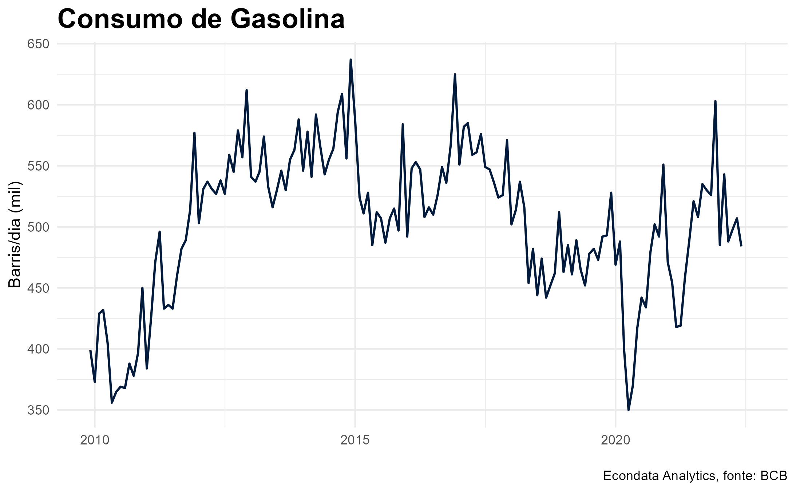
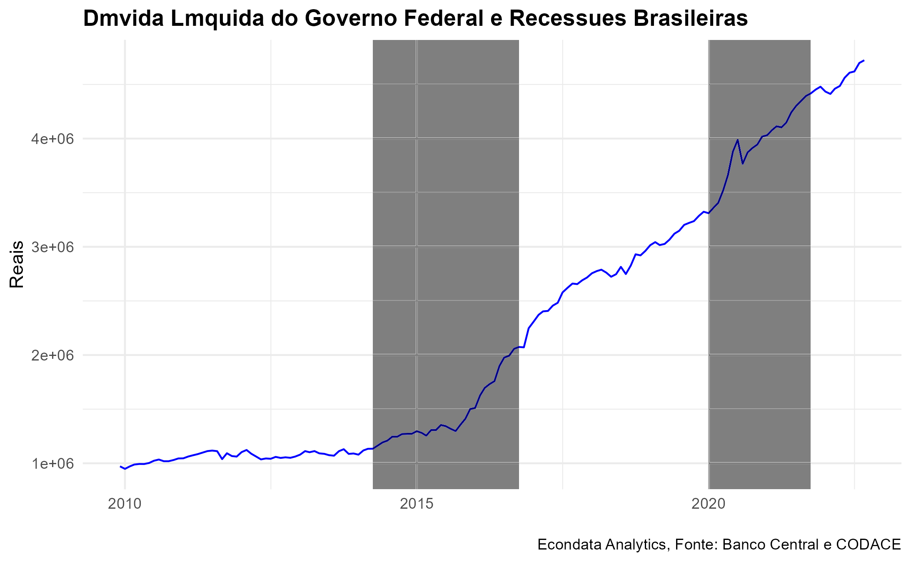

```{r, message=FALSE}
library(tidyverse)
library(janitor)
library(rbcb)
library(lubridate)
library(zoo)
```

# Inflação {.tabset}

## ICBR {.tabset}

Neste primeiro painel, é possível observar a evolução na última década do ICBR.

O Índice de Commodities do Banco Central (ICBR) existe como principal indicador nas flutuações relativas ao valor das commodities mais negociadas no Brasil. Observamos no gráfico abaixo, sua variação dentro do período de tempo estudado. Podemos observar também suas desagregações, atribuídas aos setores mais relevantes à nossa análise.

```{r, echo=F}

cat("\n")


```

## IPCA {.tabset}

### Gráficos- IPCA {.tabset}

```{r, echo=F}

cat("\n")


```

### Análises {.tabset}

#### Geral {.tabset}

Queda do IPCA agregado nos últimos meses, puxada principalmente pela queda nos setores de transporte e habitação. Além disso, também contribuem com essa queda, diminuições no IPCA dos setores de comunicação, alimentação e bebidas e artigos de residência

Pelos gráficos expostos, podemos ver que o componente de transportes apresentou grande oscilação no período de análise e foi muito impactante para as variações do IPCA no período. Em 2020, é possível ver que houve uma grande queda neste subgrupo como consequência da redução da atividade econômica e da diminuição da demanda interna e externa como consequência da pandemia, apresentando inclusive deflação no agregado de 12 meses em alguns períodos. Já em 2021 e 2022, há um grande aumento da participação do setor para contribuir com os altos níveis de inflação observados no período causados por alguns fatores como aumento do preço do barril do petróleo, depreciação do real, aumento da demanda por combustíveis no período pós-pandêmico e devido à Guerra da Ucrânia. No entanto, mudanças nas tributações sobre os combustíveis feitas pelo governo federal e pelos governos estaduais causaram uma grande diminuição nos preços dos combustíveis, levando a uma diminuição do IPCA de transportes.

#### Transportes {.tabset}

Podemos ver uma deflação acumulada em Transportes até o meio de 2020, com participação bem baixa durante todo o ano, é possível ver essa grande queda nos transportes também nas variações mensais. Causado pela diminuição da demanda internacional e interna por combustível (menor circulação de carros) e queda nos níveis de atividade econômica em razão da Covid.

Grande aumento em 2021 que se mantém em 2022, mas há uma redução contínua a partir de Julho. Aumenta em 2021 foi causado por um forte aumento da gasolina e do diesel causado pela depreciação do real e de um aumento nos preços dos barris de petróleo internacionalmente. Já em 2022, a principal causa da manutenção da grande participação na alta inflação foi a guerra da Ucrânia que foi responsável por aumentar os preços dos combustíveis mundialmente e a continuidade da desvalorização da moeda. No entanto, mudanças nas tributações sobre os combustíveis feitas pelo governo federal e pelos governos estaduais foram os grandes motivadores para a queda acentuada no índice de preços do transporte que é possível observar nos gráficos.

Outro subgrupo que teve um grande destaque para elevar o IPCA agregado ao longo de 2021 e até o começo de 2022 foi o componente de habitação. Esses sucessivos aumentos mensais que são possíveis observar no componente de habitação foram causados, principalmente, por vários reajustes bem consideráveis nos preços dos botijões de gás e da energia elétrica, causados por uma retenção dos aumentos durante o período pandêmico, em razão das dificuldades financeiras das famílias que foram amplificadas nesse momento, e pela crise hídrica que afetou o país nesse ano, com secas acentuadas em bacias hidrográficas no Centro Oeste e no Sudeste, o que dificultou a produção de energia nas usinas hidrelétricas. No entanto, a pressão inflacionária desse grupo foi em grande parte revertida no ano de 2022, com o fim das cobranças extras de energia causadas pela pandemia e a uma melhora na situação da crise hídrica.

O subgrupo de alimentação e bebidas também apresentou um papel de protagonismo no período de 2020-2022 na contribuição para os altos níveis de inflação no período. Como é possível ver pelo gráfico do IPCA acumulado de 12 meses, esse subgrupo apresentou uma grande elevação no período pandêmico, como consequência de um encarecimento da produção, com a elevação do preço dos insumos, e de uma instabilidade climática, com um período de fortes chuvas seguido por um período de secas que foi responsável por diversas perdas na produção agrícola que contribuíram para a elevação dos preços. Em seguida, após um breve período de desinflação, se desencadeou a Guerra da Ucrânia, gerando aumento nos preços das commodities do setor agrícola em todo o mundo, contribuindo para as pressões inflacionárias no setor que se veem até hoje.

#### Habitação {.tabset}

Impacto bem pequeno em 2020, mas ganhou destaque em 2021, crescendo principalmente por causa de aumentos na despesa com energia elétrica e do preço do botijão de gás

#### Alimentação e bebidas {.tabset}

Grande aumento observado a partir do meio de 2020, que mantém a inflação de alimentos em um nível alto durante todo o período de 2020-2022.

#### Educação {.tabset}

Normalmente no início dos anos tem um aumento dos preços da educação por causa de reajustes nas mensalidades no início do período escolar, durante agosto de 2020 pode-se observar uma variação de -3,47%.

## IPCA- Gráficos Alternativos {.tabset}

```{r, echo=F}

cat("\n")


knitr::include_graphics("graph_IPCA_bens_duraveis.png")


```


# Atividade Econômica {.tabset}

## Gráficos {.tabset}

```{r, echo=F}
plot_titles = data.frame(titles = c("Produção Industrial",
                                    "Produção de Óleo Bruto",
                                    "Produção de LGN",
                                    "Produção Total de Derivados de Petróleo",
                                    "Produção de Gas Natural",
                                    "Consumo de Energia Elétrica - Comercial",
                                    "Consumo de Energia Elétrica - Residencial",
                                    "Consumo de Energia Elétrica - Industrial",
                                    "Consumo de Energia Elétrica - Outros",
                                    "Consumo de Energia Elétrica - Total",
                                    "Consumo de Gasolina",
                                    "Consumo de GLP",
                                    "Consumo de Óleo Combustivel",
                                    "Consumo de Óleo Diesel",
                                    "Consumo de Outros Derivados de Petróleo",
                                    "Consumo de Derivados de Petróleo - Total",
                                    "Consumo de Álcool Hidratado",
                                    "Consumo de Álcool Anidro",
                                    "Consumo de Álcool Carburante",
                                    "Volume de Vendas no Varejo",
                                    "Taxa de Desocupação",
                                    "IVGR",
                                    "IBCBR"))

```

### Produção Industrial {.tabset}
```{r, echo=F}

cat("\n")

knitr::include_graphics("graph_Indicadores da Produção Industrial - Geral.png")

```

### Produção de Óleo Bruto {.tabset}
```{r, echo=F}

cat("\n")

knitr::include_graphics("graph_Produção de Óleo Bruto.png")

```

### Produção de LGN {.tabset}
```{r, echo=F}

cat("\n")

knitr::include_graphics("graph_Produção de LGN.png")

```

### Produção Total de Derivados de Petróleo {.tabset}
```{r, echo=F}

cat("\n")

knitr::include_graphics("graph_Produção Total de Derivados de Petróleo.png")

```

### Produção de Gás Natural {.tabset}
```{r, echo=F}

cat("\n")

knitr::include_graphics("graph_Produção de Gás Natural.png")

```

### Consumo de Energia Elétrica {.tabset}

#### Comercial {.tabset}
```{r, echo=F}

cat("\n")

knitr::include_graphics("graph_Consumo de Energia Elétrica - Comercial.png")

```

#### Residencial {.tabset}
```{r, echo=F}

cat("\n")

knitr::include_graphics("graph_Consumo de Energia Elétrica - Residencial.png")

```

#### Industrial {.tabset}
```{r, echo=F}

cat("\n")

knitr::include_graphics("graph_Consumo de Energia Elétrica - Industrial.png")

```

#### Geral {.tabset}
```{r, echo=F}

cat("\n")

knitr::include_graphics("graph_Consumo de Energia Elétrica - Total.png")

```

### Consumo de Gasolina {.tabset}
```{r, echo=F}

cat("\n")



```

### Consumo de GLP {.tabset}
```{r, echo=F}

cat("\n")


```

### Consumo de Óleo Combustível {.tabset}
```{r, echo=F}

cat("\n")

knitr::include_graphics("graph_Consumo de Óleo Combustível.png")

```

### Consumo de Óleo Diesel {.tabset}
```{r, echo=F}

cat("\n")

knitr::include_graphics("graph_Consumo de Óleo Diesel.png")

```

### Consumo de Outros Derivados de Petróleo {.tabset}
```{r, echo=F}

cat("\n")

knitr::include_graphics("graph_Consumo de Outros Derivados de Petróleo.png")

```

### Consumo de Derivados de Petróleo - Total {.tabset}
```{r, echo=F}

cat("\n")

knitr::include_graphics("graph_Consumo de Derivados de Petróleo - Total.png")

```

### Consumo de Álcool Hidratado {.tabset}
```{r, echo=F}

cat("\n")

knitr::include_graphics("graph_Consumo de Álcool Hidratado.png")

```

### Consumo de Álcool Anidro {.tabset}
```{r, echo=F}

cat("\n")

knitr::include_graphics("graph_Consumo de Álcool Anidro.png")

```

### Consumo de Álcool Carburante {.tabset}
```{r, echo=F}

cat("\n")

knitr::include_graphics("graph_Consumo de Álcool Carburante.png")

```

### Volume de Vendas no Varejo {.tabset}
```{r, echo=F}

cat("\n")


```

### IBC-BR {.tabset}
```{r, echo=F}

cat("\n")


```

## Análises {.tabset}

### Produção Industrial {.tabset}

O indicador da produção industrial compara o volume de produção inicial mês a mês com a média mensal do ano base de 2012. Analisando o gráfico, é possível notar sua sazonalidade com vales acentuados nos meses de dezembro e janeiro e certo crescimento ao longo do ano. Observando tendências de médio prazo parece clara a presença de dois patamares estacionários, um anterior à recessão de 2015 e outro posterior, demonstrando que a produção industrial praticamente não se recuperou dos efeitos dessa crise. Por outro lado, apesar do vale acentuado no início da pandemia, a produção industrial parece no geral ter se recuperado da crise do COVID-19, apesar de um 2021 um pouco abaixo do esperado.

### Volume de vendas do varejo {.tabset}

O índice de volume de vendas no varejo mede a intensidade desse comércio comparando o ao ano de 2014. Observando seu gráfico notamos primeiramente sua acentuada sazonalidade com grande intensificação nas compras de fim de ano. Podemos notar também que o comércio varejista vinha em franca ascensão até 2014, caindo com a crise de 2015 da qual ainda não se recuperou totalmente, já que segue uma tendência de crescimento bem mais suave quando comparada ao início da década. Já a recessão provocada pela pandemia teve caráter bem mais pontual com recuperação completa dos níveis pré-pandêmicos.

### IBC-BR {.tabset}

O IBC-BR tem por base o ano de 2002 e almeja medir a atividade econômica nacional real mensalmente a partir de proxies do volume de produção dos setores agrícola, industrial e de serviços. Examinando o gráfico vemos marcada sazonalidade com queda expressiva da atividade em dezembro e janeiro. Investigando tendências de prazo maior, vemos relativamente acelerado até 2014, ano em que a atividade tem leve queda e depois despenca em 2015, mal tendo se recuperado até o dia de hoje. A pandemia, por outro lado, mostrou ser uma crise de natureza pontual com retomada completa e até crescimento da atividade quando comparada a níveis pré-pandêmicos.

### Decomposição da população ocupada {.tabset}

Observando a decomposição da população ocupada por diferentes categorias de ocupação notamos grande preponderância de empregados do setor privado com carteira e empregados por conta própria, a última provavelmente composta em larga medida por postos de trabalho informais. O número de empregados do setor privado sem carteira e de empregados do setor público têm magnitudes semelhantes e os empregadores vem por último como a categoria de ocupação menos expressiva. A crise de 2015 teve grande impacto sobre a quantidade de empregados do setor privado com carteira, que ainda não se recuperou até hoje. Já o número de empregados por conta própria vem crescendo desde então, possivelmente demonstrando uma tendência de aumento da informalidade. O choque pandêmico afetou as diversas categorias de forma heterogênea: os empregados do setor privado e por conta própria sofreram queda expressiva e imediata, enquanto os empregadores sofreram queda mais lenta e os empregados do setor público mal foram afetados pela crise do COVID-19. Não obstante, todos já retornaram a seus níveis pré-pandêmicos.

### Taxa de desocupação {.tabset}

A taxa de desocupação, também chamada de taxa de desemprego, provém da razão entre a população ocupada e a força de trabalho. Ao analisar seu histórico, é clara certa sazonalidade com maior ocupação no último mês do ano. Examinando suas tendências ao longo do tempo, observa-se um aumento intenso da desocupação após a crise de 2015 da qual a economia ainda não se recuperou completamente. A pandemia, por outro lado, embora tenha provocado também um aumento significativo da desocupação, provou ser um choque temporário com retomada completa no final de 2021 e até queda expressiva em 2022 que foge dos padrões de sazonalidade anteriores.

# Setor Público {.tabset}

## Análises {.tabset}

Por último, temos uma série de gráficos que constatam a visão do Setor Público brasileiro, principalmente quanto às suas finanças.

A análise da dívida do Setor publico pode ser dividida em seus quatro componentes principais, sendo eles as dívidas: do Governo Federal, do Banco Central, dos estados e municípios da federação e das empresas estatais. Observamos essa divisão nos gráficos.

Observamos que até a crise de 2014 ambos o governo federal e os estados demonstram uma frequência de moderado aumento do déficit, com uma rápida inclinação na dívida federal durante o período da crise que se mantem até a época da covid, estranhamente vemos a dívida estadual cair durante a crise da covid e a federal continuar com seu crescimento acelerado.

O Banco Central trabalha sua dívida de forma diferente, sendo um dos maiores credores do território nacional, vemos que a dívida do banco central é trabalhada em cima dos ativos em relação aos ativos emitidos ao Governo Federal que o mesmo retem, desta forma, seu gráfico é estudado de forma inversa, em períodos de forte recessão econômica a dívida tende a cair, o que pode parecer estranho, porém quando pensamos no significado econômico vemos que é natural.

Vemos, no entanto, que esses ativos mostram maior intensidade de fluxo no início do período da pandemia, resultado da compra exacerbada de títulos públicos de forma a atingir a meta de taxa para as operações de overnight, retidos no curto prazo, levando a um vale no gráfico, com uma normalização lenta em seu decorrer e um retorno póstumo a pandemia a níveis não demonstrados desde antes da crise de 2014 e finalmente retornando a um nível natural de sazonalidade.

O último dos componentes é a dívida das estatais, que trabalha traçando o aumento da soma do déficit das balanças comerciais das empresas da federação. Vemos que a crise de 2014 afetou fortemente as estatais do Brasil, com um período de instabilidade forte antecedendo a pandemia, e uma queda rápida em expectativa a mesma, sinal da influência do início da pandemia na China no cenário global. Observamos durante a pandemia um retorno aos níveis anteriores de altas dívidas e uma queda ao final da mesma possível influência do cenário de tensões globais e o início da guerra na ucrânia, porém essa tendencia descendente não dura, vemos que no período de 2022 essa dúvida volta a ser lançada verticalmente retornando ao nível visto na expectativa da pandemia.

## Gráficos {.tabset}

Abaixo, temos uma visualização conjunta dos gráficos:

### Governo Federal 1 {.tabset}

```{r, echo=F}

cat("\n")



```

### Banco Central {.tabset}

```{r, echo=F}
cat("\n")


```

### Governos Estaduais e Municipais {.tabset}
```{r, echo=F}

cat("\n")


```

### Estatais {.tabset}
```{r, echo=F}
cat("\n")


```
